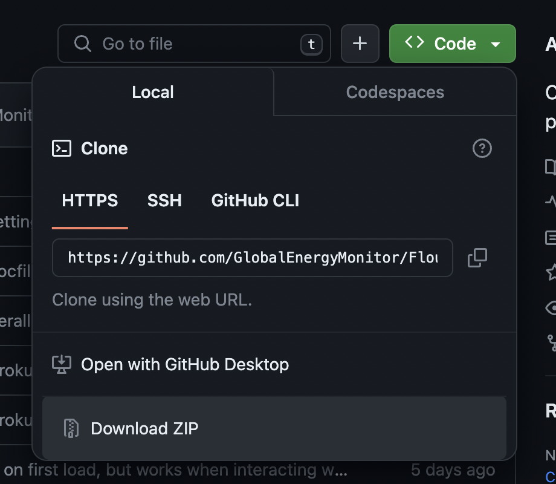

# Flourish API dashboard template
This is a template to create dashboards using Flourish graphics - such as [this one](https://flourish-dashboard-a98edc888829.herokuapp.com/)

These are developed to be configurable. You can update content in the various configs to change the graphs/data/tickers/text shown on the page. You can also duplicate it and update the configs and data to create a new dashboard.  

# Overview / How it works
There are a number of config files which control what the dashboard is showing. These can be found in `public/assets/`

* `page-config` describes what is in the whole page. Here you can specify the graphs in the page and the order they show, the tickers, the filtering type.
* `chart-config` contains the details for each chart - there are a number of config options needed, including a reference to the dataset and which keys in the data are being used where in the chart. There are optional additional config opotions, such as if the chart responds to filtering
* `text-config` this contains the text that appears outside the flourish graphics in the page - the title, any summaries etc

**Things to note:**
* Datasets for each graphic are expected to live in `public/assets/data`
* The main page building blocks are `index.js`, `index.html` and `index.css`. A server can be found in `server.js` to handle the API requests to Flourish.


# To update a dashboard
To update a dashboard, you can open any of the config files above and make changes to them. 
Any new data should be pushed to `public/assets/data` and be in `json` format.
Pushing your changes to the main branch on github should trigger an automatic rebuild on heroku and your changes should be reflected on the published dashboard almost instantly.

## An overview of each config and the options expected

### page-config.json
** Overview **
```
{
    "flourish_ids": [], // array of ids of each flourish graphic
    "input_type": "", // "buttons" or "dropdown"
    "input_filter": "", // the value of datasets that should be filtered on, needs to match an id column in each dataset
    "input_default": "", // the default value of this filter - needs to match a value in the id column
    "overall_summary": true, // boolean true/false - if there is an overall summary displayed above the graphs
    "tickers": [{ // array of objects, each representing a ticker to be shown in the intro. If no tickers needed, set to `null`
        "id": "", // id of ticker (must match dataset)
        "decimal_places": 0, // optional - can specify number of decimal places to be shown, will remove trailing 0s
        "style": {
            "color": "", // optional - can set a colour for the main number/ticking value
            "font-weight": "", // optional - can set to bold etc
            "font-size": "" // optional font size for number value
        }
    }],
    "ticker_text_font-size": "", // font size for the text in the ticker (not the number)
    "ticker_data": "" // references the datset to feed the tickers, expected to live at `public/assets/data`. Without `.json` suffix
}
```

** Example: **
```
{
    "flourish_ids": [
        "16659638",
        "16659864",
        "16533187",
        "16566530",
        "15821879",
        "16716119"

    ],
    "input_type": "buttons",
    "input_filter": "Country",
    "input_default": "Global",
    "overall_summary": true,
    "ticker_text_font-size": "2rem",
    "ticker_data": "data_ticker",
    "tickers": [{
        "id": "summary_1",
        "decimal_places": 0,
        "style": {
            "color": "#BF532C",
            "font-weight": "bold",
            "font-size": "3.5rem"
        }
    },
    {
        "id": "summary_2",
        "decimal_places": 1,
        "style": {
            "color": "#3f6950",
            "font-weight": "bold",
            "font-size": "3.5rem"
        }
    },
    {
        "id": "summary_3",
        "decimal_places": 2,
        "style": {
            "color": "#761201",
            "font-weight": "bold",
            "font-size": "3.5rem"
        }
    },
    {
        "id": "summary_4",
        "decimal_places": 2,
        "style": {
            "color": "#761201",
            "font-weight": "bold",
            "font-size": "3.5rem"
        }
    }]
}
```

### chart-config.json
** Overview **
```
{
    "FLOURISH_ID": {
        "title": "", // title of chart
        "x_axis": "", // column name in data
        "values": [], // array of strings of column names to be represented. Can be one or more (eg for simple bar vs stacked column)
        "pop_up": [], // array of strings of column names to be shown in tool tip - can be one or more values. Make `null` if not needed
        "summary": "", // the key in `text-config.json` to show as a summary above the chart. Make`null` if not needed
        "dataset": "", // the name of the datset, expected to live at `public/assets/data`. Without `.json` suffix
        "filterable": true, // boolean true/false: if chart responds to page level filtering
        "filter_by": "", // the initial key of the id column on landing - would usually match `input_filter` in page-config
        "initial_state": "", // the initial value of the id column on landing - would usually match `input_default` in page-config
    }
}
```

**Example: **
```
{
    "15821879": {
        "title": "Coal plant capacity starting construction outside China is on track for record annual low",
        "x_axis": "Period",
        "values": [
            "Yearly Construction Starts"
        ],
        "pop_up": null,
        "dataset": "data_construction",
        "summary": null,
        "filterable": false
    },
    "16566530": {
        "title": "What is the age breakdown of coal plants?",
        "x_axis": "decade",
        "values": [
            "CFB",
            "IGCC",
            "Subcritical",
            "Supercritical",
            "Ultra-supercritical",
            "Unknown"
        ],
        "pop_up": [
            "text"
        ],
        "summary": null,
        "dataset": "data_age",
        "initial_state": "Global",
        "filterable": true,
        "filter_by": "Country"
    },
    "16533187": {
        "title": "How has coal power capacity changed since 2000?",
        "x_axis": "Year",
        "values": [
            "Capacity"
        ],
        "pop_up": null,
        "summary": "cumulative_summary",
        "dataset": "data_cumulative",
        "initial_state": "Global",
        "filterable": true,
        "filter_by": "Country"
    }
}
```

### text-config.json
** Overview **
```
{
    "title": "", // title of the whole dashboard
    "no_data": "No data available for {{selected}}", // no data message - {{selected}} will be replaced by an option from the buttons/dropdown. If not using filtering, remove this from the no data message.
    "buttons_label": "",  // This is the CTA before the input. If using a dropdown, the key should be `dropdown_label`
    "buttons": [ // Each entry here reflects a dropdown/button option and the values that will be outputted when it is selected. if using a dropdown, the key should be `dropdown`. 
      {
        "INPUT_FILTER": "INPUT_VALUE",
        "overall_summary": "", // summary shown above all graphs / in intro
        "graph-1_text": "", // summary shown above graph 1
        "graph-2_text": "", // summary shown above graph 2
      }
    ]
}
```

Things to note 
* buttons/dropdown can handle any number of options. For buttons it is not recommended to use more than 6
  

**Example: **

```
{
    "title": "Coal dashboard",
    "no_data": "No data available for {{selected}}",
    "buttons_label": "Select a country: ",
    "buttons": [
      {
        "Country": "Global",
        "overall_summary": "Global summary sentence here",
        "cumulative_text": "coal capacity has almost doubled from 2000",
        "change_text": "Need to develop a sentence for Global",
        "status_text": "Global has 2,095,041 MW of operating coal power capacity and 557,465 MW under development",
        "age_text": "The largest share of coal power in Global is 10-19 years old"
      },
      {
        "Country": "United Kingdom",
        "overall_summary": "_UK_ summary sentence here",
        "cumulative_text": "has no operating coal power",
        "change_text": "neither added or retired any coal",
        "status_text": "UK TEXT.CONFIG",
        "age_text": "UK"
      },
      {
        "Country": "United States",
        "overall_summary": "**USA** summary sentence here",
        "cumulative_text": "increased its coal power capacity from 2000",
        "change_text": "has not retired any coal since 2000",
        "status_text": "USA has 495 MW of operating coal power capacity and 120 MW under development",
        "age_text": "The largest share of coal power in USA is 40-49 years old"
      }
    ]
}
```

# To create a new dashboard
[TODO: TEST THIS AND UPDATE]
1. To create a new dashboard, you will need to duplicate this template/repo. You can do this either via the GH dashboard or the terminal.

*via the GitHub UI*
* Scroll to the top of this page and click code > Download Zip
  
* Create a new repo

*via the terminal*

1. Update the configs and datasets
2. Create a new instance on heroku
   * New project
   * Add bundle (node.js)
   * Set to auto update
3. Add Flourish API key
   * got to flourish
   * add to heroku
4. Check the URL
5. Add page to GEM site
   * go to wordpress
   * create new page with tracker template

# To develop the templates / use locally
* open your terminal
* clone repo
* `cd` into project run `npm install`
* get a flourish API key [following instructions here](https://developers.flourish.studio/api/getting-started/)
* create `.env` file in the root of the project (this is important so the code knows where to find it and it doesn't get commited to github)
* copy the below into it and save:
```
FLOURISH_API_KEY=YOUR_API_KEY_HERE
PORT=8080
```
* run `npm start`
* open your browser and navigate to http://localhost:8080/

### To make changes / show different graphs
You can control which graphs are showing, and in what order from `public/assets/config.json`

**Overview:**
```
{
    "flourish-id": {
        "title": "Title of the graph", // this can be changed dynamically - eg replacing a flag `{{country}}` with a value
        "x_axis": "column-1", // this references the column name of the linked dataset
        "values": [ // array of column names of the linked dataset. One for classic bar chart/simple scatter, multiple for combined columns
            "column-2",
            "column-3",
        ],
        "pop_up": [
            "column-4" // column name for any tool tip info - can have more than one value
        ],
        "summary": "key", // refers to entry in dropdowns in `text.json` to pull sentences from
        "dataset": "data", // name of dataset. Currently this is local to the project, the dataset should be in `assets/data` and be a json file
        "initial_state": "state-1", // landing state of graph (eg country set to filter to Global)
        "filterable": true, // is the graph filterable eg by country. This value is a boolean true/false
        "filter_by": "column-5" // what it is filterable by
    },
    "flourish_ids": [
        "id-1", // order of flourish ids as the graphs will appear in the page. Must have corresponding ID in this json file
        "id-2"

    ],
    "input_type": "dropdown", // input type to add to the page: dropdown (or soon to be buttons)
    "filter_key": "column-5", // what column in dataset to filter by
    "overall_summary": true // boolean to show/hide overall summary which updates on interaction
}
```

**Example:**
```
{
    "15821879": {
        "title": "Coal plant capacity starting construction outside China is on track for record annual low",
        "x_axis": "Period",
        "values": [
            "Yearly Construction Starts"
        ],
        "pop_up": null,
        "summary": null,
        "dataset": "data_construction",
        "filterable": false
    },
    "16566530": {
        "title": "What is the age breakdown of coal plants?",
        "x_axis": "decade",
        "values": [
            "CFB",
            "IGCC",
            "Subcritical",
            "Supercritical",
            "Ultra-supercritical",
            "Unknown"
        ],
        "pop_up": [
            "text"
        ],
        "summary": "age_text",
        "dataset": "data_age",
        "initial_state": "Global",
        "filterable": true,
        "filter_by": "Country"
    },
    "flourish_ids": [
        "15821879",
        "16566530"

    ],
    "input_type": "dropdown",
    "filter_key": "Country"
}
```

## Updating text
All of this should be configurable. A lot of the main text (outside of the individual graphics) is controlled through `text.json`

**Overview**
```
{
    "title": "Coal dashbaord",
    "intro": "Below is a container for a flourish viz",
    "dropdown_label": "Select a country: ",
    "title_variation_initial": "globally",
    "title_variation_filtered": "in {{country}}",
    "title_flag": "{{country}}",
     "dropdown": [
        {
          "Country": "Global",
          "overall_summary": "",
          "cumulative_text": "coal capacity has almost doubled from 2000",
          "change_text": "Need to develop a sentence for Global",
          "status_text": "Global has 2,095,041 MW of operating coal power capacity and 557,465 MW under development",
          "age_text": "The largest share of coal power in Global is 10-19 years old"
        },
                {
          "Country": "Albania",
          "overall_summary": "",
          "cumulative_text": "has no operating coal power",
          "change_text": "neither added or retired any coal",
          "status_text": "Albania has 0 MW of operating coal power capacity and 0 MW under development",
          "age_text": "Albania does not have any operating coal power"
        },
        ...
     ]
}
```
* To update any of these values just navigate to `public/assets/text.json`
* The text fields under 'dropdown' refer to summary text outputted for each variation of the graphs
